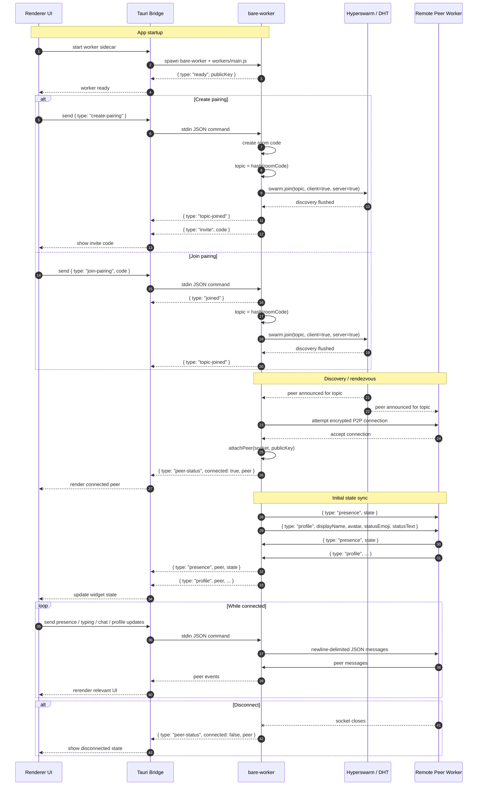

# togather

small P2P telepresence app. Tauri app with a Bare sidecar worker using Hyperswarm for P2P


## Download the latest release

Get the newest build from the [latest GitHub release](https://github.com/clairefro/togather/releases/latest).

### macOS

1. Open the [latest release page](https://github.com/clairefro/togather/releases/latest).
2. Download the macOS `.dmg` asset.
3. Open the `.dmg` and drag `togather` into Applications.
4. Launch from Applications. If macOS says the app is damaged or cannot be
   opened, open Terminal and run:

```bash
xattr -cr /Applications/togather.app
```

5. Launch `togather` from Applications again.

Only use this workaround for a copy downloaded directly from this project's
GitHub release page. The app is currently distributed without Apple Developer
ID signing or notarization, so macOS may quarantine downloaded copies.

### Windows

1. Open the [latest release page](https://github.com/clairefro/togather/releases/latest).
2. Download the Windows installer (`.msi` or `.exe`).
3. Run the installer and complete setup.
4. Launch `togather` from Start Menu.

### Linux

1. Open the [latest release page](https://github.com/clairefro/togather/releases/latest).
2. Download the Linux asset for your distro (`.AppImage` / `.deb` / other).
3. Install or run according to your distro conventions.
4. Launch `togather`.

### Chromebooks

Chromebooks are not an officially supported target. The Linux build may work on
an Intel Chromebook with **Linux development environment** enabled, but the
current Linux release is x86_64/amd64 only and will not run on ARM Chromebooks.
ChromeOS may also restrict always-on-top, transparent, or click-through window
behavior.

If your OS is not listed in release assets yet, check back later or build locally.

## Project shape

- `renderer/` — plain HTML, CSS, and browser JavaScript. It owns the Tauri
  shell bridge, onboarding, presence UI, chat popover, and window APIs.
- `workers/` — an ESM Bare program with one Hyperswarm instance, exposing the
  specified newline-delimited JSON protocol over stdin/stdout.
- `src-tauri/` — minimal Rust bootstrap plus Tauri v2 window configuration and
  a capability scope that permits only the `bare-worker` command (`bare` with
  the packaged `workers/main.js` entry point).

## Tooling

- Node.js is used only for package installation and the Tauri CLI.
- Install the Bare runtime globally before running the app: `npm install -g bare`.
- Install root dependencies with `npm install`, then worker dependencies with
  `npm install --prefix workers`.
- Run the desktop app with `npm run dev`.

## Release builds

- A GitHub Actions workflow is configured at
  `.github/workflows/release.yml`.
- Pushing a tag like `v0.1.1` triggers cross-platform Tauri builds
  (macOS, Windows, Linux).
- The workflow creates a **draft GitHub Release** and uploads generated
  artifacts automatically.

### Create a release

1. Run the local release automation script with the next version (example: `0.1.5`):

```bash
npm run release -- 0.1.5
```

This will:

- root `package.json` (`version` field)
- `src-tauri/tauri.conf.json`
- `src-tauri/Cargo.toml`

- commit the changes
- create the matching tag (`v0.1.5`)
- push `main` and the tag to `origin`

2. Open the Actions tab and confirm the `Release` workflow succeeds.
3. Open GitHub Releases, review the draft release notes and uploaded assets,
   then publish it.

### Updating after first release

- Repeat the same flow with a new version and tag (`v0.1.2`, `v0.1.3`, etc).
- This project currently uses **manual app updates** for users:
  download and install the latest release artifact from GitHub Releases.

## Platform behavior

- **macOS:** the app enables Tauri's `macOSPrivateApi` for transparent windows
  and asks to appear on all Spaces, including full-screen Spaces.
- **Windows:** the native always-on-top and cursor-ignore APIs are used. Windows
  cannot draw over an application using exclusive full-screen mode.
- **Linux:** the same APIs are requested. X11 compositors normally support the
  overlay; Wayland compositors may deny always-on-top or click-through by their
  security policy, in which case the UI reports the failed action instead of
  silently blocking input.
- When click-through is enabled, press **Escape** to make the widget interactive
  again.

## App sequence



## Attributions

Notification sound from https://mixkit.co/
